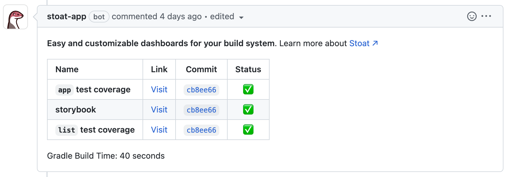

# Stoat Examples

| Sample Project | Description |
| --- | --- |
| [backend](backend) | Sample Gradle project generating multiple JaCoCo HTML outputs. |
| [frontend](frontend) | Sample React app that generates Storybook outputs. |

# What is Stoat?

Turn PR comments into developer dashboards with templating and artifact previews for code coverage reports, frontend components, doc sites, and more! [Visit our docs website to learn more ↗︎](https://docs.stoat.dev/)

---

